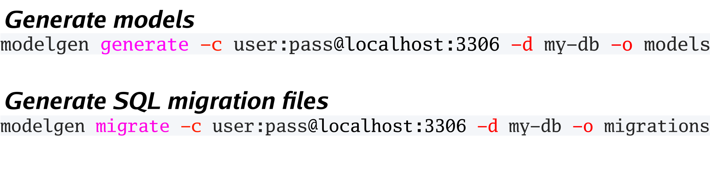

# ModelGen

ModelGen generates working database interaction code from reading your MySQL / MariaDB database.

## Conventions:

`modelgen` assumes your database will follow a couple conventions:

- tables must have a primary key `id` field
- column names must not collide with a valid Go type, ex: string

The primary `id` doesn't need to auto-increment, though it is recommended.

## Usage:

```
Usage:
   [command]

Available Commands:
  generate    Generate models from a database connection
  help        Help about any command
  migrate     Generate migration files from a database connection

Flags:
  -c, --connection string   user:pass@host:port
  -d, --database string     name of database
  -h, --help                help for this command
  -o, --output string       path to package (default "generated_models")
  -p, --package string      name of package (default "generated_models")
    	
Example:
modelgen -c root:pass@localhost:3306 -d my-db -o models generate
```

## Visual Aid:



## Credit:

Modelgen is built using the following amazing libraries:

- [github.com/spf13/cobra](https://github.com/spf13/cobra)
- [github.com/go-sql-driver/mysql](https://github.com/go-sql-driver/mysql)

