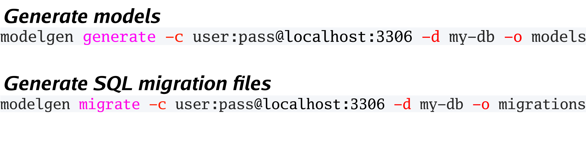

# Modelgen [](https://raw.githubusercontent.com/LUSHDigital/modelgen/master/LICENSE) [](https://goreportcard.com/report/github.com/LUSHDigital/modelgen) [](https://travis-ci.org/LUSHDigital/modelgen)

Modelgen generates working database interaction code from reading your MySQL / MariaDB database.

## Install:

```bash
brew tap lushdigital/tools
brew install modelgen
```

This will install `modelgen` under `/usr/local/bin`.

If you want to uninstall it, simply delete it, or run `brew uninstall modelgen`

## Conventions:

`modelgen` assumes your database will follow a couple conventions:

- tables must have a primary key `id` field
- column names must not collide with a valid Go type, ex: string

The primary `id` doesn't need to auto-increment, though it is recommended.

## Ordering:

In cases where you want the migrations to be generated in a particular order (ex. because of foreign key constraints)
you can control this by simply adding a comment to your `id` field.

This format must take the following format:

```
# for example a the user table id has the comment:
modelgen:1

# then the user_post table id has the comment:
modelgen:2

```

by doing so you ensure that the `user` table always gets migrated before the `user_post` table.

## Usage:

```
Usage:
   [command]

Available Commands:
  generate    Generate models from a database connection
  help        Help about any command
  migrate     Generate migration files from a database connection

Flags:
  -c, --connection string   user:pass@host:port
  -d, --database string     name of database
  -h, --help                help for this command
  -o, --output string       path to package (default "generated_models")
  -p, --package string      name of package (default "generated_models")

Example:

# Create models
modelgen generate -c root:pass@localhost:3306 -d my-db -o models

# Create migrations
modelgen migrate -c root:pass@localhost:3306 -d my-db -o migrations
```

## Visual Aid:



## Credit:

Modelgen is built using the following amazing libraries:

- [github.com/spf13/cobra](https://github.com/spf13/cobra)
- [github.com/go-sql-driver/mysql](https://github.com/go-sql-driver/mysql)

